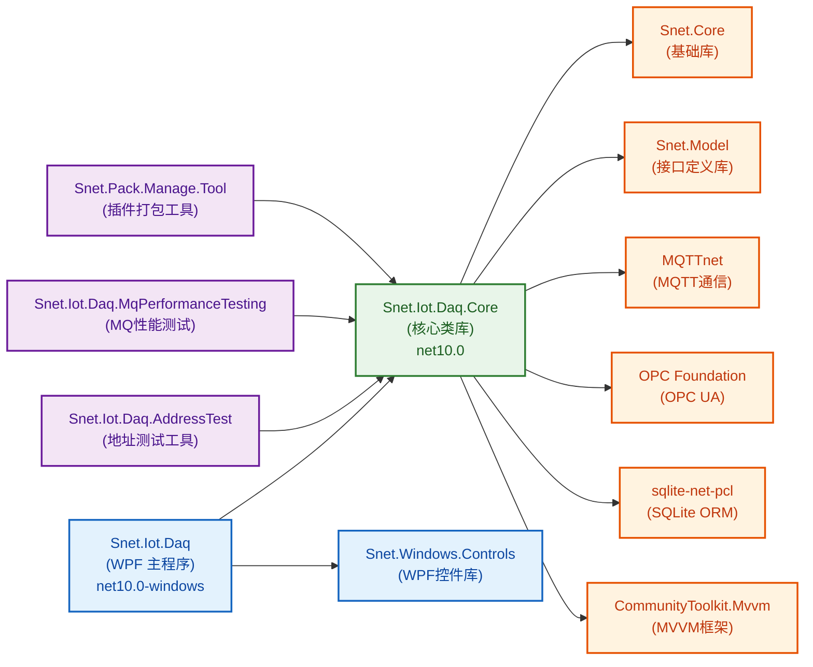
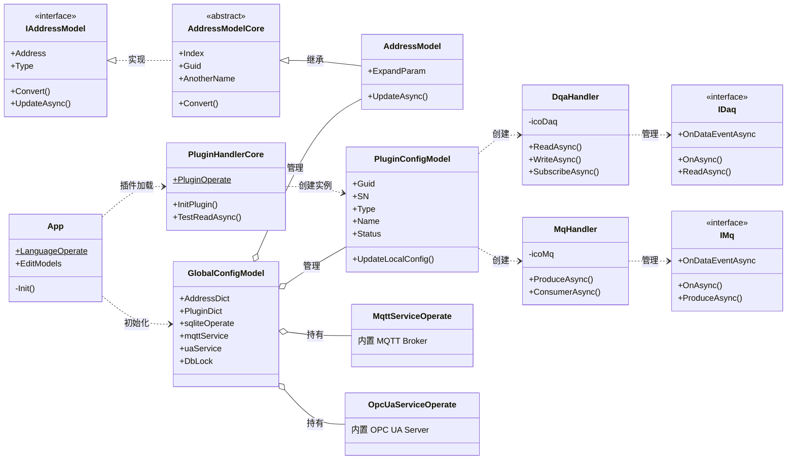
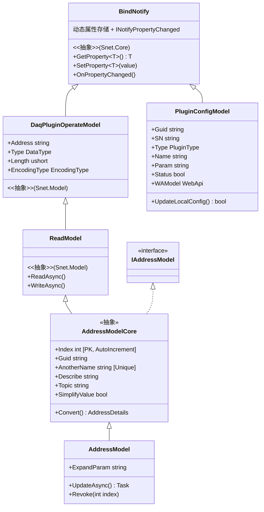
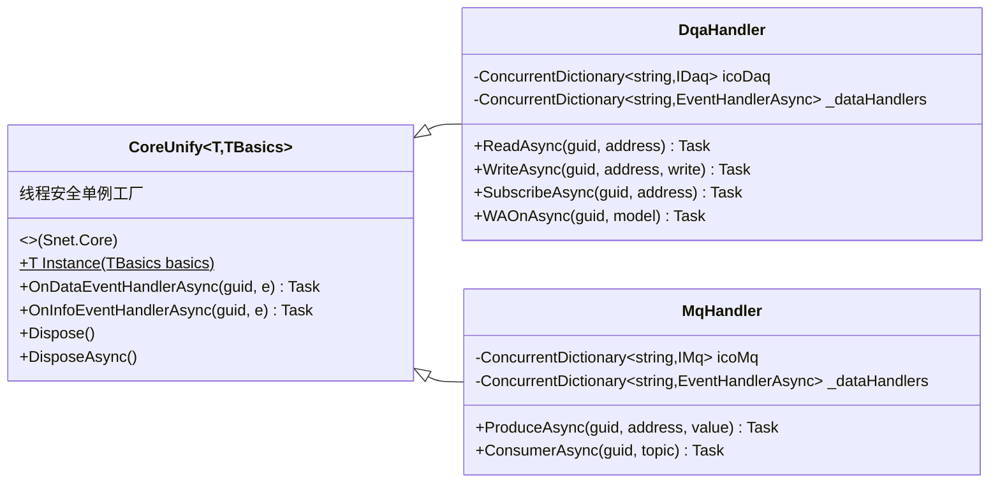
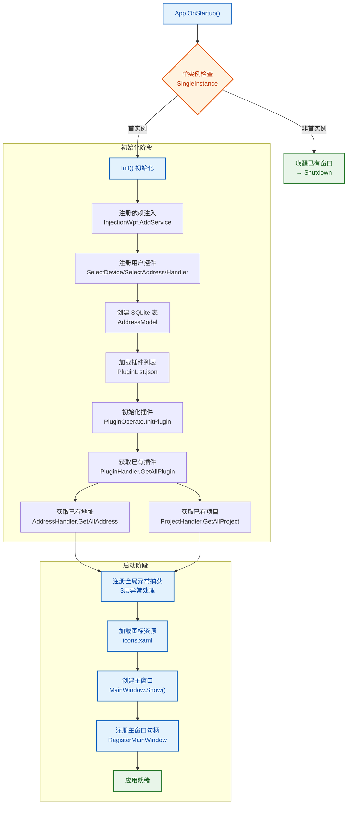
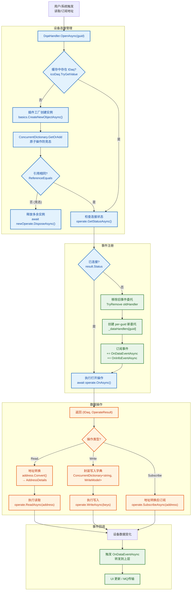
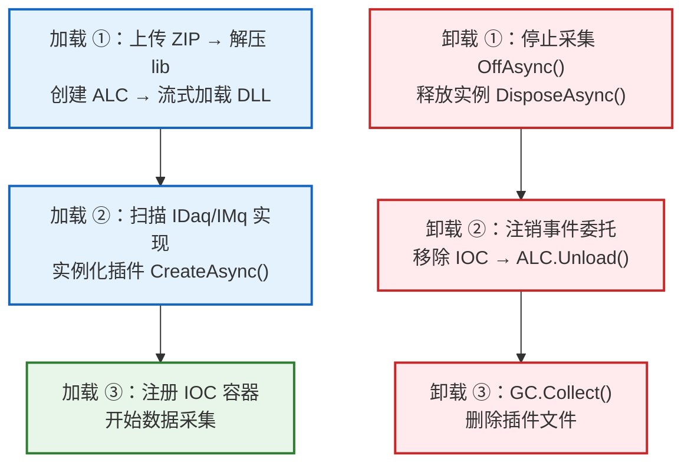
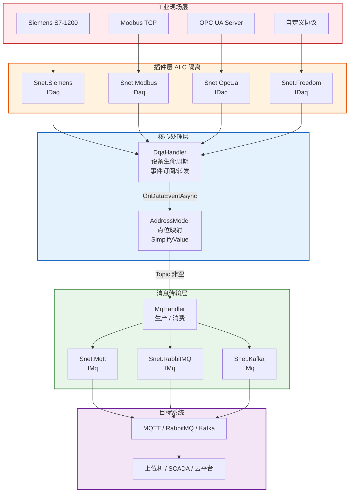

# Snet.Iot.Daq 架构设计文档

> **版本**: v1.0 | **更新日期**: 2026-06-21 | **框架**: .NET 10.0 | **类型**: WPF 桌面应用

---

## 目录

1. [项目概述](#1-项目概述)
2. [解决方案结构](#2-解决方案结构)
3. [核心 UML 类图](#3-核心-uml-类图)
4. [核心流程图](#4-核心流程图)
5. [设计模式分析](#5-设计模式分析)
6. [代码详解与使用方式](#6-代码详解与使用方式)

---

## 1. 项目概述

**Snet.Iot.Daq** 是一个基于 .NET 10 的开源工业物联网（IIoT）数据采集工具，采用插件化架构，支持运行时热插拔。核心能力：

- **数据采集 (DAQ)**: 通过 IDaq 插件接口，支持 Siemens、Modbus、Mitsubishi、Omron、AllenBradley、OPC DA/UA 等 30+ 种工业协议
- **消息传输 (MQ)**: 通过 IMq 插件接口，支持 MQTT、RabbitMQ、Kafka 等消息队列
- **内置服务**: 内嵌 MQTT Broker 和 OPC UA Server
- **插件热插拔**: 基于 `AssemblyLoadContext`，运行时加载/卸载插件，无需重启
- **点位管理**: 基于 SQLite 的地址配置与持久化

---

## 2. 解决方案结构



| 项目 | 类型 | 框架 | 说明 |
|------|------|------|------|
| **Snet.Iot.Daq** | WPF 应用 | net10.0-windows | 主程序，提供 UI 界面与用户交互 |
| **Snet.Iot.Daq.Core** | 类库 | net10.0 | 核心逻辑层，包含 Handler、插件管理、数据模型、服务端实现 |
| **Snet.Iot.Daq.AddressTest** | 控制台 | - | 地址读写功能测试工具 |
| **Snet.Iot.Daq.MqPerformanceTesting** | 控制台 | - | MQTT 消息传输性能压测工具 |
| **Snet.Pack.Manage.Tool** | 控制台 | - | 插件 ZIP 打包管理工具 |

---

## 3. 核心 UML 类图

### 3.1 整体架构类图



### 3.2 数据模型继承链



### 3.3 Handler 继承链



---

## 4. 核心流程图

### 4.1 应用启动流程



### 4.2 数据采集完整流程



### 4.3 插件热插拔流程



**关键技术要点**

| 要点 | 说明 |
|------|------|
| 可回收上下文 | `AssemblyLoadContext(isCollectible: true)` 支持运行时卸载 |
| 流式加载 | `MemoryStream + LoadFromStream`，无文件锁，支持即时删除 |
| 类型一致性 | 共享接口从默认上下文加载，确保 `as`/`is` 转换正确 |
| 并发安全 | `ConcurrentDictionary` 管理实例与上下文引用 |
| 双插件类型 | DAQ 采集插件 + MQ 传输插件，独立生命周期 |

### 4.4 数据采集 → 消息传输数据流



> **数据流说明**：PLC 设备数据经 IDaq 插件采集 → DqaHandler 统一管理生命周期与事件转发 → AddressModel 点位映射（可精简数据）→ 若配置了 Topic 则通过 MqHandler 转发至 IMq 插件 → 最终送达 MQTT/RabbitMQ/Kafka Broker → 上位机/云平台消费。

---

## 5. 设计模式分析

### 5.1 插件架构 (Plugin Architecture)

最核心的设计模式。整个系统围绕两个扩展接口构建：

| 接口 | 命名空间 | 职责 | 典型插件 |
|------|----------|------|----------|
| `IDaq` | `Snet.Model.@interface` | 数据采集：连接设备、读取/写入地址、订阅变化 | Snet.Siemens, Snet.Modbus, Snet.OpcUa |
| `IMq` | `Snet.Model.@interface` | 消息传输：生产/消费消息、连接消息中间件 | Snet.Mqtt, Snet.RabbitMQ, Snet.Kafka |

**技术实现**:
- 基于 .NET `AssemblyLoadContext(isCollectible: true)` 实现可回收程序集上下文
- 使用 `MemoryStream` + `LoadFromStream` 流式加载 DLL，避免文件锁
- 插件 ZIP 解压 → 创建上下文 → 扫描接口 → 实例化 → 注册 IOC
- 卸载时逐步释放：停止采集 → Dispose → 移除 IOC → 卸载上下文 → GC 回收 → 删除文件

**对应代码**: `Snet.Iot.Daq.Core/handler/PluginHandlerCore.cs`

```csharp
// 初始化插件
PluginHandlerCore.PluginOperate.InitPlugin(
    item.PluginDetails.Path,
    string.Format(GlobalConfigModel.InterfaceFullName, item.Type)
);

// 通过配置创建插件实例
public static async Task<T?> CreateNewObjectAsync<T>(this PluginConfigModel plugin)
    => await PluginOperate.CreateAsync<T>(plugin.Name, plugin.Param, plugin.Type);
```

### 5.2 单例模式 (Singleton) - `CoreUnify<T, TBasics>`

Handler 类通过泛型基类 `CoreUnify<T, TBasics>` 实现"按配置键的单例"——同一个插件配置（相同 PluginConfigModel）始终返回同一个 Handler 实例。

**对应代码**: `Snet.Iot.Daq.Core/handler/DqaHandler.cs`、`MqHandler.cs`

```csharp
public class DqaHandler : CoreUnify<DqaHandler, PluginConfigModel>, IDisposable, IAsyncDisposable
{
    // Instance(basics) 工厂方法保证相同配置返回同一实例
}
```

### 5.3 MVVM 模式 (Model-View-ViewModel)

使用 `CommunityToolkit.Mvvm` 和 `Snet.Windows.Controls` 框架：

| 层 | 路径 | 示例 |
|----|------|------|
| **Model** | `Snet.Iot.Daq/data/` | `AddressModel`, `GlobalConfigModel` |
| **View** | `Snet.Iot.Daq/view/` | `MainWindow.xaml`, `SelectDevice.xaml` |
| **ViewModel** | `Snet.Iot.Daq/viewModel/` | `MainWindowModel`, `HandlerModel` |

**依赖注入**:
```csharp
// App.Init() 中注册
InjectionWpf.UserControl<SelectDevice, SelectDeviceModel>(true);
InjectionWpf.UserControl<SelectAddress, SelectAddressModel>(true);
InjectionWpf.UserControl<view.Handler, HandlerModel>(true);
```

### 5.4 观察者模式 (Observer) - 事件驱动数据流

数据从设备 → Handler → UI / MQ 的流转完全基于事件：

```csharp
// DqaHandler 内部注册设备事件
EventHandlerAsync<EventDataResult> newDataHandler = 
    async (sender, e) => await Operate_OnDataEventAsync(sender, e, guid);
operate.OnDataEventAsync += newDataHandler;

// 事件触发后转发到上层
private async Task Operate_OnDataEventAsync(object? sender, EventDataResult e, string guid)
{
    await OnDataEventHandlerAsync(guid, e);  // 由 CoreUnify 基类提供
}
```

### 5.5 资源管理模式 - `IAsyncDisposable`

所有 Handler 和插件实例都实现了 `IAsyncDisposable`，使用 `try/finally` 确保资源可靠释放：

```csharp
// 测试读取 - 确保资源释放
public static async Task<OperateResult> TestReadAddressAsync(this IAddressModel model, PluginConfigModel plugin)
{
    IDaq? daqNew = await plugin.CreateNewObjectAsync<IDaq>();
    try
    {
        // ... 执行读取操作
    }
    finally
    {
        await daqNew.OffAsync();
        await daqNew.DisposeAsync();
    }
}
```

### 5.6 并发安全策略

| 组件 | 策略 | 说明 |
|------|------|------|
| `icoDaq` / `icoMq` | `ConcurrentDictionary` | 线程安全的设备实例缓存 |
| `_dataHandlers` | `ConcurrentDictionary` | per-guid 事件委托管理，防止多设备事件泄漏 |
| `AddressDict` / `PluginDict` | `ConcurrentDictionary` | 全局地址和插件缓存 |
| `DbLock` | `lock` 同步 | SQLite 不是线程安全的，所有数据库操作必须加锁 |
| 批量操作 | `Task.WhenAll` + `ConcurrentBag` | 并行发送消息，ConcurrentBag 收集错误 |

---

## 6. 代码详解与使用方式

### 6.1 项目编译与运行

```bash
# 1. 克隆仓库
git clone https://github.com/shunnet/Daq.git
cd Daq

# 2. 使用 Visual Studio 2022+ 打开
Snet.Iot.Daq.sln

# 3. 选择 Debug / Release 构建

# 4. 运行
./Snet.Iot.Daq/bin/Debug/net10.0-windows/Snet.Iot.Daq.exe
```

### 6.2 添加一个数据采集点位

```csharp
// 1. 创建地址模型
IAddressModel address = new AddressModel
{
    Address = "DB1.DBD0",          // Siemens S7 地址格式
    Type = DataType.Float,         // 数据类型：浮点数
    Length = 4,                    // 数据长度
    AnotherName = "温度传感器1",    // 别名
    Topic = "factory/line1/temp",  // 传输主题（可选）
    SimplifyValue = false          // 是否精简数据
};

// 2. 持久化到 SQLite
lock (GlobalConfigModel.DbLock)
{
    GlobalConfigModel.sqliteOperate.Insert(address);
}
GlobalConfigModel.AddressDict[address.Guid] = address;

// 3. 读取点位数据
var pluginConfig = GlobalConfigModel.PluginDict["device-sn-001"];
var result = await DqaHandler.Instance(pluginConfig).ReadAsync(pluginConfig.Guid, address);

// 4. 订阅点位变化（持续推送）
await DqaHandler.Instance(pluginConfig).SubscribeAsync(pluginConfig.Guid, address);
```

### 6.3 插件开发与热加载

```csharp
// === 开发一个 IDaq 插件 ===
// 1. 新建 .NET 类库项目，引用 Snet.Model
// 2. 实现 IDaq 接口：

public class MyDevicePlugin : IDaq
{
    public event EventHandlerAsync<EventDataResult> OnDataEventAsync;
    public event EventHandlerAsync<EventInfoResult> OnInfoEventAsync;

    public async Task<OperateResult> OnAsync()
    {
        // 连接设备
        return OperateResult.CreateSuccessResult("Connected");
    }

    public async Task<OperateResult> ReadAsync(Address address)
    {
        // 读取设备地址数据
        return OperateResult.CreateSuccessResult(data);
    }

    // ... 实现其他接口方法
}

// 3. 编译后打包为 ZIP
// 4. 在程序 UI "插件设置" 页面上传 ZIP → 自动热加载
```

### 6.4 配置数据流转 (DAQ → MQ)

```csharp
// 场景：Siemens PLC 温度数据 → MQTT Broker

// Step 1: 配置 DAQ 采集设备
var siemensConfig = new PluginConfigModel
{
    Type = PluginType.Daq,
    Name = "Snet.Siemens.SiemensDaq",
    Param = "{\"IP\":\"192.168.1.100\",\"Rack\":0,\"Slot\":1}",
    SN = "siemens-001"
};

// Step 2: 配置 MQTT 传输
var mqttConfig = new PluginConfigModel
{
    Type = PluginType.Mq,
    Name = "Snet.Mqtt.MqttMq",
    Param = "{\"Broker\":\"localhost\",\"Port\":1883}",
    SN = "mqtt-001"
};

// Step 3: 创建地址，绑定 Topic
var tempAddress = new AddressModel
{
    Address = "DB1.DBD0",
    Type = DataType.Float,
    Topic = "factory/temperature",  // ← 关键：绑定传输主题
    SimplifyValue = false,
    Guid = siemensConfig.Guid
};

// Step 4: 订阅采集数据 → 事件触发 → 自动生产到 MQTT
await DqaHandler.Instance(siemensConfig).SubscribeAsync(siemensConfig.Guid, tempAddress);

// 当 PLC 数据变化时：
// IDaq.OnDataEventAsync 触发 
// → DqaHandler 接收 (OpenAsync 中已注册事件)
// → 根据 address.Topic 调用 MqHandler.ProduceAsync
// → IMq 将数据发送到 MQTT Broker
```

### 6.5 内置 MQTT Server 启动

```csharp
// 启动内置 MQTT Broker
GlobalConfigModel.mqttService = new MqttServiceOperate();
await GlobalConfigModel.mqttService.StartAsync();

// 启动内置 OPC UA Server
GlobalConfigModel.uaService = new OpcUaServiceOperate();
await GlobalConfigModel.uaService.StartAsync();
```

### 6.6 目录结构约定

```
{AppContext.BaseDirectory}/
├── db/
│   └── address.db              # SQLite 数据库
├── lib/                         # 插件目录
│   ├── Snet.Siemens.Daq.Config.json
│   ├── Snet.Modbus.Daq.Config.json
│   └── Snet.Mqtt.Mq.Config.json
├── config/
│   ├── ui/
│   │   ├── PluginList.json      # 插件列表
│   │   ├── PluginConfig.json    # 插件配置
│   │   └── ProjectConfig.json   # 项目配置
│   └── server/
│       ├── MqttServerConfig.json
│       └── UaServerConfig.json
├── Snet.Iot.Daq.exe
└── Snet.Iot.Daq.Core.dll
```

---

## 附录

### 关键命名空间速查

| 命名空间 | 路径 | 说明 |
|----------|------|------|
| `Snet.Iot.Daq` | `Snet.Iot.Daq/` | WPF 主程序入口、App.xaml.cs |
| `Snet.Iot.Daq.data` | `Snet.Iot.Daq/data/` | UI 层数据模型、全局配置 |
| `Snet.Iot.Daq.view` | `Snet.Iot.Daq/view/` | WPF XAML 视图文件 |
| `Snet.Iot.Daq.viewModel` | `Snet.Iot.Daq/viewModel/` | MVVM ViewModel |
| `Snet.Iot.Daq.handler` | `Snet.Iot.Daq/handler/` | UI 层业务逻辑 |
| `Snet.Iot.Daq.Core.@interface` | `Snet.Iot.Daq.Core/interface/` | 核心接口定义 (`IAddressModel`) |
| `Snet.Iot.Daq.Core.data` | `Snet.Iot.Daq.Core/data/` | 核心数据模型 (`AddressModelCore`, `PluginConfigModel`) |
| `Snet.Iot.Daq.Core.handler` | `Snet.Iot.Daq.Core/handler/` | 核心处理器 (`DqaHandler`, `MqHandler`, `PluginHandlerCore`) |
| `Snet.Iot.Daq.Core.mqtt.service` | `Snet.Iot.Daq.Core/mqtt/service/` | 内置 MQTT Broker |
| `Snet.Iot.Daq.Core.opc.ua.service` | `Snet.Iot.Daq.Core/opc/ua/service/` | 内置 OPC UA Server |
| `Snet.Model.@interface` | 外部 NuGet | 插件接口 (`IDaq`, `IMq`) |
